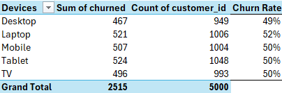
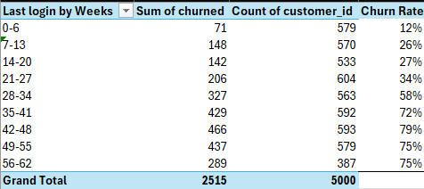
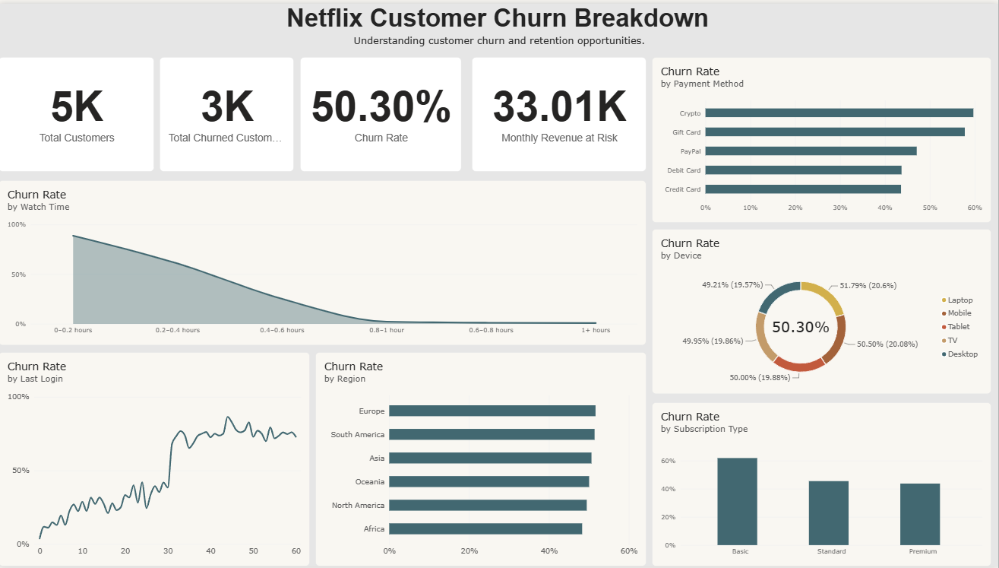

# Netflix Churn Analysis
Customer churn analysis using SQL (PostgreSQL), Excel, and PowerBI, aiming to identify the key factors associated with customer churn and uncover actionable insights to improve customer retention.

Note: This is a simulated dataset ("Netflix Customer Churn" by Abdul Wadood - Kaggle), and does not reflect Netflix's actual reported churn figures.

## Repository Structure
- `/SQL` - PostgreSQL queries used for churn analysis and data exploration
- `/Excel` - Formula-based analysis
- `/PowerBI` - Interactive dashboard for visualising churn trends
- `/Dataset` - Raw dataset used for this project

## SQL
### Data Validation 
Before analysis, the dataset was checked for structural integrity: 
- Total records: 5000
- Unique customers: 5000 (no duplicate `customer_id`'s found)
- One row per customer - dataset is clean and ready for analysis

### Business Findings
#### Churn Rate
- Overall, 50.3% of customers in this dataset are marked as churned. 
- It should be noted that this is a simulated dataset without an explicit churn window, and therefore cannot be compared to industry monthly/annual streaming benchmarks. 
- However, this 50.3% can act as a baseline. This baseline helps to identify where the biggest problems and opportunities lie within specific customer segments, such as: subscription types, regions, devices, etc.  

#### Churn Concentration 
##### Profiles
- Churn is notably lower for account with 4-5 profiles (37.54%-40.62%), compared to accounts with 1-3 profiles (57.44%-58.64%).
- This suggests accounts with 4-5 profiles specifically may be less likely to cancel, likely due to shared/household use, though this is entirely hypothetical and not something the data itself confirms. 

|Number of Profiles|Churn Rate|
|---|---|
|4|37.54|
|5|40.62|
|1|58.64|
|3|57.85|
|2|57.44|

##### Age and Demographic
- Churn rate is nearly identical across all age brackets (49.1%-51.55%), closely matching the overall 50.3% baseline.

|Age Bracket|Churn Rate|
|---|---|
|18-25|50.69|
|26-40|49.30|
|41-60|51.55|
|61+|49.12|

- The same conclusion can be made for the demographic of the customers. The churn rate is almost identical across all 3 gender groups. 

|Gender|Churn Rate|
|---|---|
|Other|49.79|
|Male|50.00|
|Female|51.08|

- This suggests the ages and demographic of the customers are not a meaningful driver of churn in this dataset. 

##### Subscription Tier
- Customers who bought the Basic subscription, churn at the highest rate (61.83%) and also account for the highest churn volume (1027 customers) - which is more than the Standard (748) or Premium (740) individually. This makes the Basic subscription tier the largest single contributor to customer loss in this dataset, both relatively and in absolute numbers.
- A possible hypothesis as to why the Basic subscribers churn at the highest rate and volume, may be due to its lower price point, attracting customers who are likely using the subscription as a trial or as a casual user, making them naturally quicker to cancel than someone on a pricier, more committed plan. 

|Subscription Type|Churn Volume|Churn Rate|
|---|---|---|
|Basic|1027|61.83|
|Premium|740|43.71|
|Standard|748|45.44|

##### Region
- Both churn rate and lost revenue are fairly consistent across all regions, with no single region standing out as a major outlier - similar to what was seen with age and gender. 

|Region|Churn Rate|Monthly lost Revenue|
|---|---|---|
|Europe|51.67|5885.52|
|South America|51.43|5873.51|
|Asia|50.65|5567.74|
|Oceania|50.07|5127.17|
|North America|49.47|5523.79|
|Africa|48.32|5032.12|

##### Watch Hours
- Watch hours show by far the strongest relationship with churn found in this analysis. Customers watching 0-5 hours churn 79.25%, compared to just 0.90% for those watching 31+ hours. 
- Low watch hours might be an early warning sign of churn, not just something that happens alongside it. A customer's viewing may start dropping off before actually cancelling their subscription, meaning this metric could be used to help flag at-risk customers ahead of time.
- Customers flagged for having low watch hours may get personalised recommendations of movies/tv shows based on their favourite genres, in order to boost engagement. 

|Watch Hours|Churn Rate|
|---|---|
|0-5|79.25|
|6-15|43.64|
|16-30|17.52|
|31+|0.90|

## Excel 

#### Churn Concentration 
The tables in this section are pivot tables created from the original dataset to further explore and analyse customer churn across different factors. 

##### Devices
- Churn rate is nearly identical across all devices (49%-52%), consistent with the flat pattern seen in age, gender, and region.
- Therefore, the device a customer uses is not a meaningful driver of churn.

##### Last Login
- Churn rate rises sharply and consistently with days since last login - from 12% at 0-6 days, up to 79% at 42-48 days, before leveling off around 75% at the highest brackets. This, alongside watch hours, is one of the strongest factors associated with churn.

### Watch Time Grouping
- The `avg_watch_time_per_day` variable contained a wide range of individual values, making it difficult to identify clear patterns when visualised in PowerBI. Therefore, in order to improve readability and make the analysis more meaningful, the values were grouped into the following ranges in Excel: 

## Power BI
The Power BI dashboard brings together the key findings from the SQL and Excel analysis into an interactive visualisation of customer churn. 

### Dashboard

### Summary
- The analysis found that customer engagement metrics - specifically watch hours and login recency - showed the greatest associations with churn, whereas factors such as age, gender, device, and region showed relatively little variation in churn rates.
- Judging by the line chart for churn rate by login recency, it shows a sudden spike around day 30, after which churn remains consistently high. This suggests that customers who have not logged in for around 30 days or more, may be at a higher risk of churn.
- Using this data, we could send targeted content notifications, such as movie/tv show recommendations based on previously watched content by the user, to customers who are approaching 30 days of inactivity.
- A similar pattern can be seen with watch hours, where lower engagement is strongly assocated with higher churn. 